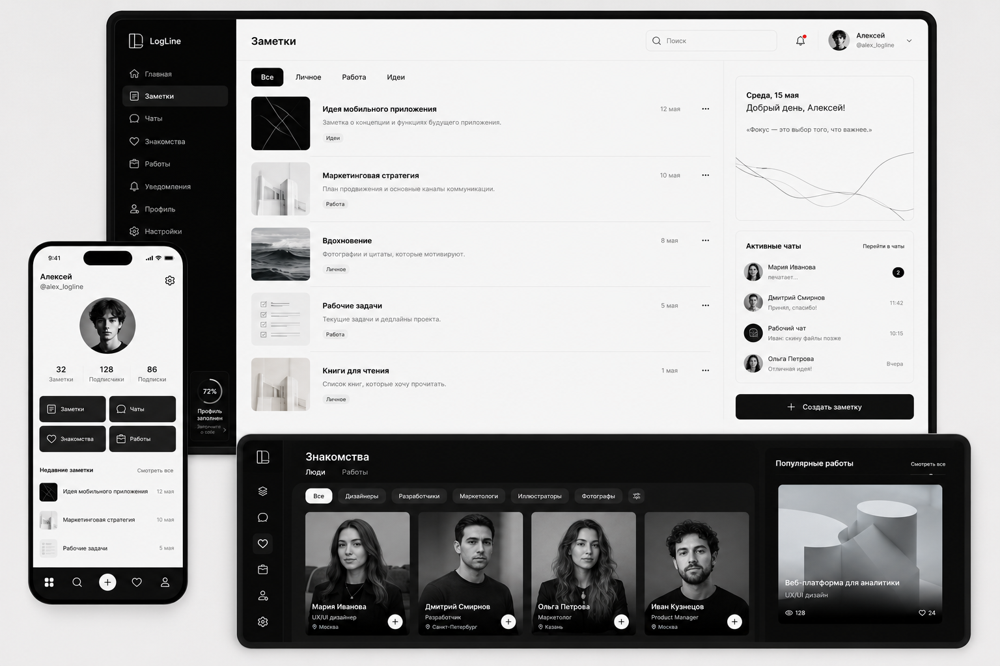

<!-- markdownlint-disable MD033 MD041 -->
<a id="readme-top"></a>

<div align="center">


<p>
  <a href="https://discord.gg/6bMMJZxyGS"><· Join the conversation ·></a>
</p>

<p>
  <a href="LICENSE"></a>
  
</p>

</div>

## О проекте

**LogLine** — это трекер разработчика, который превращает хаос ежедневного кодинга в понятную картину прогресса.

Вместо того чтобы гадать, сколько ты выучил, LogLine фиксирует каждый шаг: что ты изучал, какие ошибки делал, сколько кода написал. Бэкенд анализирует твои записи и строит графики коммитов, частоту ошибок и динамику роста.

### Зачем это нужно?

- **Видеть прогресс.** Ты перестаёшь чувствовать, что стоишь на месте.
- **Анализировать ошибки.** Понимать, на чём ты спотыкаешься чаще всего.
- **Строить график роста.** Знать, сколько строк кода ты написал за месяц.

## Вид

<div align="center" style="display: flex; gap: 20px; justify-content: center; flex-wrap: wrap;">
  
  
</div>


## Быстрый старт

Вот как запустить LogLine за пару минут:

1. **Клонируй репозиторий**  
   ```bash
   git clone https://github.com/MagentaFNS/LogLine.git
2. **Перейди в папку проекта и запусти**
**Следуй инструкции по установке в разделе Установка.**

3. **Начни записывать свои отчёты**
**Ты увидишь свой первый график прогресса уже через 5 минут.**

## Установка LogLine
<details> <summary><strong>macOS / Linux</strong></summary>
<pre>
cd LogLine
python -m venv venv
source venv/bin/activate
pip install -r requirements.txt
</pre>
</details>
<details> <summary><strong>Windows (PowerShell)</strong></summary>
<pre>
cd LogLine
python -m venv venv
venv\Scripts\activate
pip install -r requirements.txt
</pre>
</details>

## Как это работает
- Записывай короткие отчёты: **«Что изучил», «Что сломал», «Что починил»**.

- **LogLine анализирует их и показывает:**

- **График коммитов.**

- **Частоту ошибок.**

- **Количество нового кода.**

- **Ты видишь свой прогресс в реальном времени.**

## Особенности
**Работаем вместе с командой** — проект для входа в IT.

**Минималистичный интерфейс** — всё, что нужно, без лишнего шума.

**Интеграция с GitHub** — анализ коммитов без лишних телодвижений.

## Полностью открытый исходный код
**LogLine имеет полностью открытый исходный код под лицензией MIT license, и мы приглашаем вас создать систему контроля версий будущего в открытом доступе.**
**Чтобы принять участие, зайдите в Discord сервер.**

## Вклад в проект
**Приветствуется любой вклад** — код, документация, сообщения об ошибках и обзоры.

**Если у тебя есть идея, создай Issue или предложи Pull Request.**

## Лицензия
**LogLine выпущен под лицензией MIT.**
**Авторское право (c) 2026 Magenta.**

## Контакты и сообщество
**Discord — общайтесь в чате с командой и сообществом на [Discord](https://discord.gg/48an2b7guA).**

**GitHub** — следите за обновлениями и участвуйте в разработке через Issues и Pull Requests.

<p align="right">(<a href="#readme-top">наверх</a>)</p>